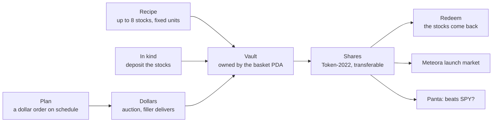

<div align="center">


**Index funds of tokenized stocks.** Bind up to eight companies into one share, backed by the real stocks in an onchain vault and redeemable for them any time.

[**Open Sheaf**](https://sheaf-index.vercel.app) · [Plans](https://sheaf-index.vercel.app/plans) · [Chains](https://sheaf-index.vercel.app/chains) · [How it works](https://sheaf-index.vercel.app/method) · [Program docs](docs/program.md)

     

</div>

---

Tokenized stocks now trade around the clock on Solana, Ethereum, Arbitrum, Robinhood Chain and Hyperliquid. What nobody can do yet is hold a theme as one position: "the companies building AI", "bitcoin by proxy", "the S&P plus gold". Today that means buying five tokens and rebalancing by hand, or trusting someone's fund.

**Sheaf turns a list of companies and a set of weights into one token.** The program writes the recipe once and gives up the power to change it. A share is created by depositing exactly the stocks the recipe names and redeemed by taking exactly those back, so nothing is priced by an oracle and no share can exist without the stocks behind it. Anyone can check the vault with two RPC calls.

On top of that core:

| | What it does | Where |
|---|---|---|
| **Buy with dollars** | Escrow dollars for a share count that falls over ninety seconds. The first filler to deliver the stocks takes the dollars; the vault still gets the real stocks. Competition sets the price, not an oracle. | Solana program `place_order` / `fill_order` |
| **Monthly plans** | A fixed amount into a basket on a schedule, the SIP habit behind India's index-fund boom. Anyone can run a due plan; every fill moves the plan's reference price to where the market cleared. | Solana program `open_plan` / `run_plan` |
| **Launch markets** | Every basket can open a Meteora Dynamic Bonding Curve priced from its own NAV, graduating into a locked DAMM v2 pool. | Meteora DBC + DAMM v2 |
| **Prediction markets** | "Will this basket beat SPY this week?" as a Panta market, settled from the basket's own vault value. | Panta API |
| **The tape** | Live tokenized-stock trades on Solana mainnet, decoded every few seconds. | Solami RPC |
| **Every chain** | The same immutable recipe, vault and cash desk, native on Robinhood Chain (real Robinhood stock tokens) and Tempo (dollar gas, recurring spending limits). | `evm/` |

## Try it in two minutes

1. Open **[sheaf-index.vercel.app](https://sheaf-index.vercel.app)** and connect any Solana wallet set to devnet. The site sends a little devnet SOL to an empty wallet.
2. Open a basket, choose **With dollars**, press **Get 1,000 test dollars**, then **Place a $100 order**. Within about a minute a filler delivers the stocks and the shares land in your wallet.
3. Choose **Monthly**, pick **Every 5 minutes**, and start a plan. Watch it gather on **[Plans](https://sheaf-index.vercel.app/plans)**.
4. **[Create](https://sheaf-index.vercel.app/compose)** your own basket from 28 tokenized stocks and pre-IPO companies (OpenAI, Anthropic, SpaceX through PreStocks), then open its launch market.

Prices, dividend multipliers and the tape come from **Solana mainnet**. Creation, redemption, orders and plans settle on **devnet** against mirror mints that carry the same Token-2022 extensions as the real ones, because an unaudited program should not take custody of real stocks.

<p align="center">
  
  
</p>
<p align="center">
  
  
</p>

## What a judge can check

- **Every share is backed.** Each basket page shows what the vault holds against what the shares claim, with the two RPC calls that prove it. Deposits round up and redemptions round down, so the vault can only hold more than it owes.
- **The program cannot be steered.** No admin key, no fee switch, no oracle. The recipe is written once; the share mint's authority is the basket itself. [docs/program.md](docs/program.md) lists every instruction, account, seed and error.
- **Cash never meets a price feed.** A dollar order is a Dutch auction on share count. The buyer chooses the floor; fillers choose when to fill. A plan's reference price is the last fill, nothing else.
- **Everything is on the ledger.** [The ledger](https://sheaf-index.vercel.app/ledger) decodes every creation and redemption from the program's own events.
- **The EVM vaults are verified.** Robinhood Chain on Blockscout, Tempo on Sourcify; see [evm/README.md](evm/README.md).

## How a share works



## The program

`programs/sheaf` (Anchor 0.31, Token-2022). Program `GaYNg5YZdNRa82Qn1383mvF1aEKhjVNmbsWg1UBNt8zz` on devnet.

| Instruction | Who can call | What it does |
|---|---|---|
| `create_basket` | anyone | Writes a recipe of up to 8 mints, units per share, weights and a creator fee up to 1%. |
| `mint_shares` | anyone | Deposits the recipe in kind and mints shares; the creator's fee is paid in shares. |
| `redeem_shares` | a holder | Burns shares and returns the components. Always available. |
| `place_order` | anyone | Escrows dollars for a share count that decays from start to end. |
| `fill_order` | anyone | Delivers the components at the current count; the buyer gets shares, the filler gets the dollars. |
| `cancel_order` | buyer, or anyone after expiry | Returns the dollars. |
| `open_plan` / `run_plan` / `close_plan` | owner / anyone when due / owner | A recurring dollar order with a capped allowance. |

39 tests cover backing under random sequences, transfer-fee gross-up, auction math at every point, plan scheduling, and the attacks that matter: wrong vaults, redirected fees, stale fills, early cancels.

## Run it yourself

```bash
# Program (Linux or WSL, Anchor 0.31.1, Solana 4.2)
anchor test

# Web
cd web && pnpm install && pnpm dev

# EVM vaults
cd evm && npm install && npx hardhat test
```

The web app's environment is documented in [web/.env.example](web/.env.example). Use your own Solami, Helius and Panta keys; a `pk_test_` Panta key runs against Panta's sandbox.

## Repository

```
programs/sheaf   the Solana program
tests            39 program tests
web              Next.js app: pages, the keeper, the RPC proxy, share images
evm              Solidity vaults, cash desk and mirrors for EVM chains, 100 tests
scripts          devnet setup: mirrors, test dollar, seed baskets, launch markets
docs             program reference
```

## Business

A basket's creator earns up to 1% of every share created, paid in shares, never out of the vault. Launch markets pay the creator half of trading fees. Sheaf's revenue is the other half of launch-market fees and the migration fee; the vault itself pays nobody.

---

Built on Solana, Meteora, Solami, Panta, Robinhood Chain and Tempo. Not investment advice. xStocks are issued by Backed Finance and PreStocks by PreStocks; Sheaf issues neither and only holds them in the vaults a basket writes to.
