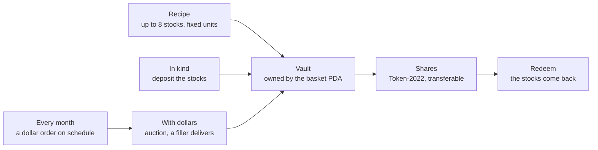

<div align="center">


**Index funds of tokenized stocks.** Bind up to eight tokenized stocks into one share, backed in kind by an onchain vault and redeemable for those stocks at any time.

[**Open Sheaf**](https://sheaf-index.vercel.app) · [How it works](https://sheaf-index.vercel.app/method) · [Ledger](https://sheaf-index.vercel.app/ledger) · [Chains](https://sheaf-index.vercel.app/chains) · [Program reference](docs/program.md)

    

</div>

---

Tokenized stocks now trade around the clock on Solana and several EVM chains, but you still cannot hold a theme ("the AI builders", "the S&P plus gold") as one position. Today that means buying five tokens and rebalancing by hand, or trusting someone's fund. **Sheaf turns a list of stocks and weights into one token.** The program writes the recipe once and never changes it. A share is created by depositing exactly the stocks the recipe names and redeemed by taking exactly those back. No oracle prices anything, and no share can exist without the stocks behind it. On top of that core: dollar orders filled by competing fillers in a Dutch auction, monthly plans anyone can run when due, a Meteora launch market per basket, a Panta prediction market per basket, and a live mainnet tape through Solami.

## Live

| | |
|---|---|
| App | [sheaf-index.vercel.app](https://sheaf-index.vercel.app): connect any Solana wallet set to devnet; an empty wallet gets a little devnet SOL |
| Create a basket | [/compose](https://sheaf-index.vercel.app/compose): 28 tokenized stocks (20 xStocks, 8 PreStocks pre-IPO tokens such as OpenAI, Anthropic, SpaceX) |
| Browse | [/explore](https://sheaf-index.vercel.app/explore) · [/plans](https://sheaf-index.vercel.app/plans) · [/predict](https://sheaf-index.vercel.app/predict) · [/portfolio](https://sheaf-index.vercel.app/portfolio) |
| Proof | [/ledger](https://sheaf-index.vercel.app/ledger) (every program event, decoded in your browser) · [/chains](https://sheaf-index.vercel.app/chains) (each EVM vault read from its own chain) |
| Program | [`GaYNg5YZdNRa82Qn1383mvF1aEKhjVNmbsWg1UBNt8zz`](https://explorer.solana.com/address/GaYNg5YZdNRa82Qn1383mvF1aEKhjVNmbsWg1UBNt8zz?cluster=devnet) on Solana devnet |

Try it in two minutes: open a basket, choose **With dollars**, press **Get 1,000 test dollars**, then place a $100 order. A filler delivers the stocks within about a minute and the shares land in your wallet. Then choose **Monthly** and start a plan on a 5-minute period to watch it run.

## How it works



| Step | What happens | Instructions |
|---|---|---|
| **Bind** | Anyone writes a recipe: 1 to 8 Token-2022 mints, raw units per share, weights, and a creator fee of at most 1%. The basket PDA becomes the share mint's authority; no instruction edits the recipe. | `create_basket` |
| **Buy in kind** | Deposit exactly the recipe for N shares and receive N shares (less the creator fee, minted to the creator as new shares). Deposits round up and are grossed up for any component transfer fee, so the vault always nets the full recipe. | `mint_shares` |
| **Buy with dollars** | Escrow dollars for a share count that falls linearly over the auction (the site uses 90 seconds, from 2% above the fair count to 2% below). The first filler to deliver the stocks at the current count takes the dollars; the vault receives the stocks through the same deposit path. Fillers compete on timing, so no price feed is read. The buyer, or anyone after expiry, can cancel for a full refund. | `place_order`, `fill_order`, `cancel_order` |
| **Every month** | A plan approves exactly `cash_per_run × runs` to the plan PDA once. When a run is due, anyone can turn it into a dollar order bracketing a reference rate. Each fill moves the reference to the rate the market cleared at, bounded by the owner's min and max. | `open_plan`, `run_plan`, `update_plan`, `close_plan` |
| **Redeem** | Burn shares and take the components back, rounded down. Always available to any holder. | `redeem_shares` |

Every instruction, account, seed, event and error is in [docs/program.md](docs/program.md).

## Proof

What you can check without trusting this README:

- **Backing.** Every basket page has a backing table and, under it, the two RPC calls that reproduce it: the share mint's supply and each vault's balance. If vault ≥ supply × units per share for every component, every share is backed.
- **History.** [/ledger](https://sheaf-index.vercel.app/ledger) decodes every creation, redemption, order, fill and plan run from the program's own events, in the browser. There is no database.
- **Tests.** `tests/sheaf.ts` and `tests/mainnet-clone.ts` hold 59 integration tests (`anchor test`) and `lib.rs` 10 unit tests (`cargo test -p sheaf --lib`): backing through 40 random creations and redemptions, transfer-fee gross-up, auction math at start, middle and end, plan scheduling and bounds, and the attacks that matter (impostor vaults, redirected shares and fees, stale fills, early cancels, hostile mint extensions), plus a basket of byte-for-byte clones of mainnet TSLAx, NVDAx and a PreStock created, minted and redeemed with every issuer power intact. The EVM suite in `evm/` has 100 tests.
- **Launch lifecycle.** A full Meteora launch on devnet, from first buy through graduation to every fee claim, with each signature: [docs/meteora.md](docs/meteora.md).
- **EVM vaults.** The same vault, recipe and dollar desk as Solidity contracts, deployed and source-verified on five testnets:

| Chain | Chain ID | SheafFactory | CreationDesk | Verified on |
|---|---|---|---|---|
| Robinhood Chain testnet | 46630 | [`0xC836C83E283DA57aBD13c271Dd73D22B65dF89B1`](https://explorer.testnet.chain.robinhood.com/address/0xC836C83E283DA57aBD13c271Dd73D22B65dF89B1#code) | [`0x4184eb1540908CB0DbEd533c45Fba7123991951C`](https://explorer.testnet.chain.robinhood.com/address/0x4184eb1540908CB0DbEd533c45Fba7123991951C#code) | Blockscout |
| Tempo testnet (Moderato) | 42431 | [`0x4925f418fac49b26C68Ac7016Ba3591cDbF895e7`](https://explore.testnet.tempo.xyz/address/0x4925f418fac49b26C68Ac7016Ba3591cDbF895e7) | [`0x4EB6955e6bD0912EA2E5230f0B3D8DD4Bc7a2Eb0`](https://explore.testnet.tempo.xyz/address/0x4EB6955e6bD0912EA2E5230f0B3D8DD4Bc7a2Eb0) | Sourcify (contracts.tempo.xyz) |
| Ethereum Sepolia | 11155111 | [`0x08Ec8CD0db8c09b27b349e0F1e495083961cD9E0`](https://eth-sepolia.blockscout.com/address/0x08Ec8CD0db8c09b27b349e0F1e495083961cD9E0) | [`0x336cd7CF93e6b4CF4072C8C99D189B9eAc8126E4`](https://eth-sepolia.blockscout.com/address/0x336cd7CF93e6b4CF4072C8C99D189B9eAc8126E4) | Blockscout |
| Arbitrum Sepolia | 421614 | [`0x4EB6955e6bD0912EA2E5230f0B3D8DD4Bc7a2Eb0`](https://arbitrum-sepolia.blockscout.com/address/0x4EB6955e6bD0912EA2E5230f0B3D8DD4Bc7a2Eb0) | [`0x3A9b55976D4f385AD00acdCdb29Fe3DD43aB09A0`](https://arbitrum-sepolia.blockscout.com/address/0x3A9b55976D4f385AD00acdCdb29Fe3DD43aB09A0) | Sourcify |
| Base Sepolia | 84532 | [`0x4EB6955e6bD0912EA2E5230f0B3D8DD4Bc7a2Eb0`](https://base-sepolia.blockscout.com/address/0x4EB6955e6bD0912EA2E5230f0B3D8DD4Bc7a2Eb0) | [`0x3A9b55976D4f385AD00acdCdb29Fe3DD43aB09A0`](https://base-sepolia.blockscout.com/address/0x3A9b55976D4f385AD00acdCdb29Fe3DD43aB09A0) | Blockscout |

Basket, stock-token and stablecoin addresses for each chain, plus smoke-test hashes, are in [evm/README.md](evm/README.md) and [`web/lib/deployments/`](web/lib/deployments).

## Sponsor integrations

| Sponsor | What Sheaf does with it | Doc |
|---|---|---|
| **Meteora** | Each basket can open a Dynamic Bonding Curve priced from its own NAV (opens at 0.5× NAV, graduates at 5× NAV into a DAMM v2 pool with all LP permanently locked). Launch addresses derive from the basket, so discovery needs no indexer, and a pool only counts if the basket's creator opened it. One launch has been taken through its whole life on devnet. | [docs/meteora.md](docs/meteora.md) |
| **Panta** | Each basket carries a market, "Will this basket beat SPY this week?", resolved from the basket's vault value, which Sheaf publishes as JSON at `/api/nav/<basket>`. Discovery, quotes, create, trade, positions and claims all run through Panta's API, against its sandbox (`pk_test_` key). | [docs/panta.md](docs/panta.md) |
| **Solami** | Mainnet reads go through Solami's RPC: every xStock's dividend multiplier (which sets NAV) and a live tape of tokenized-stock trades, decoded every few seconds. | [docs/solami.md](docs/solami.md) |

## Chains

| Chain | What runs there | Stocks | Cash |
|---|---|---|---|
| Solana devnet | The Sheaf program: baskets, dollar orders, plans; Meteora launch markets | Mirrors of the 28 mainnet mints | Sheaf test dollar (Token-2022) |
| Solana mainnet | Read only: prices, dividend multipliers, the tape | xStocks, PreStocks | – |
| Robinhood Chain testnet | Factory, desk, 3 baskets (HOOD5, CHIPS, PRIME) | Robinhood's own test stock tokens | USDG (testnet) |
| Tempo testnet | Factory, desk, 3 baskets; monthly plans through Tempo access keys with recurring spending limits | 8 labelled mirrors | AlphaUSD (TIP-20) |
| Ethereum Sepolia | Factory, desk, 3 baskets | 8 labelled mirrors | sUSD mirror |
| Arbitrum Sepolia | Factory, desk, 3 baskets | 8 labelled mirrors | sUSD mirror |
| Base Sepolia | Factory, desk, 3 baskets | 8 labelled mirrors | sUSD mirror |
| Hyperliquid (HyperEVM testnet) | Read only: a recipe priced from HyperCore stock perps through precompiles; nothing deployed | – | – |

## Business

Full breakdown with sources: [/business](https://sheaf-index.vercel.app/business).

| Who earns | What | Source |
|---|---|---|
| Sheaf (protocol) | 0.10% of every share created, fixed per basket when the basket is created and never changeable, accrued in the basket and claimed to the treasury as shares. Redeeming is free. Baskets created before this fee shipped carry none, for good. | `PROTOCOL_FEE_BPS` in `programs/sheaf/src/lib.rs` |
| Basket creator | 0% to 1% of every share created (`MAX_CREATOR_FEE_BPS = 100`), minted as new shares, never taken from the vault. The composer defaults to 0.25%. | `programs/sheaf/src/lib.rs` |
| Fillers, including Sheaf's house filler | A dollar order's share count starts 2% above fair and falls to 2% below over 90 seconds; the first filler to deliver keeps the difference. The house filler waits until it earns 0.15% over fair, so any filler willing to take less fills first. | `FILL_MARGIN_BPS` in `web/lib/keeper-server.ts` |
| Sheaf and the creator | Launch-market curve fees: Meteora keeps 20%, then 50/50, so 40% each. A 25% anti-snipe fee decays to 1% over 600 seconds. | `web/lib/meteora-preset.json` |
| Sheaf | A 1% migration fee at graduation, the 1% of launch-token supply left over after the curve, and half the fees of the graduated pool's locked LP. | `web/lib/meteora-preset.json` |

Holding a share costs nothing a year; there is no management fee. Monthly plans are free; each run pays the same fees as a dollar order. The first customers are platforms that already sell tokenized stocks to non-US retail and add baskets and monthly plans as a module for a revenue share.

## Run it yourself

```bash
# Program (Linux or WSL, Anchor 0.31.1)
anchor test                      # 59 integration tests on a local validator
cargo test -p sheaf --lib        # 9 unit tests

# Web app
cd web && pnpm install && pnpm dev

# EVM contracts
cd evm && npm install && npx hardhat test    # 100 tests
```

The web app reads these variables (see [web/.env.example](web/.env.example); only names are listed here):

| Variable | Secret | Purpose |
|---|---|---|
| `NEXT_PUBLIC_WRITE_CLUSTER` | no | `devnet` or `localnet` |
| `NEXT_PUBLIC_SHEAF_PROGRAM_ID` | no | the deployed program |
| `NEXT_PUBLIC_SITE_URL` | no | public URL for share images and the sitemap |
| `NEXT_PUBLIC_MAINNET_RPC` | no | mainnet fallback when `SOLAMI_API_KEY` is unset |
| `HELIUS_API_KEY` | yes | devnet RPC behind `/api/rpc` |
| `SOLAMI_API_KEY` | yes | mainnet reads |
| `PANTA_API_KEY` | yes | `pk_test_` runs against Panta's sandbox |
| `PANTA_API_BASE` | no | Panta API base URL override |
| `FAUCET_SECRET_KEY` | yes | mint authority of the devnet mirrors, for `/api/faucet` and the house keeper |
| `EVM_FAUCET_PRIVATE_KEY` | yes | testnet deployer key for the EVM faucet and keeper |
| `ADMIN_TOKEN` | yes | guards `/api/admin/launch` |

### Run your own filler

[`scripts/filler.mjs`](scripts/filler.mjs) is a standalone filler anyone can run against the house keeper. It needs the component tokens in its wallet (the site's faucet hands out devnet mirrors) and keeps the dollars it is paid.

```bash
node scripts/filler.mjs --keypair ~/.config/solana/id.json --dry-run --once   # price and simulate only
node scripts/filler.mjs --keypair ~/.config/solana/id.json --edge-bps 20
```

| Flag | Default | |
|---|---|---|
| `--keypair` | `~/.config/solana/id.json` | wallet that delivers the stocks and is paid |
| `--edge-bps` | `20` | minimum margin over the stocks' cost |
| `--cash-mint` | `CASH_MINT` from `web/lib/cash.generated.ts` | the only cash mint it fills; every other mint is skipped |
| `--rpc` | `https://api.devnet.solana.com` | write cluster |
| `--site` | `https://sheaf-index.vercel.app` | source of mainnet quotes |
| `--dry-run` | off | print what it would fill; sign nothing |
| `--once` | off | one pass, then exit |

Because `place_order` is permissionless, an order can name any token as cash. The filler refuses every cash mint but one, reads decimals and the Token-2022 transfer fee from that mint, reads the recipe from chain rather than the site, and simulates each fill to check that its cash balance rises by at least the expected net payout before it sends anything.

## Trust model

- **No oracle.** Creation and redemption are in kind. Dollar orders are auctions on share count; a plan's reference is its own last fill.
- **No editable recipe.** No admin key, no rebalance authority, no fee switch: every fee is fixed per basket at creation. The share mint's authority is the basket PDA.
- **The program is upgradeable on devnet.** Its upgrade authority is a single deploy key. Before it holds real tokens it moves to a multisig after an audit. The multisig is kept, not burned, so new issuers (Ondo, Robinhood, Dinari) can be added to `KNOWN_ISSUERS`; an upgrade can change any code, so the multisig, a public timelock and a verifiable build are the safeguards.
- **Devnet, with mirror mints.** The program is unaudited, so it does not take custody of real stocks. Prices, dividend multipliers and the tape come from mainnet; vaults hold devnet mirrors. The mirrors match the real mints' decimals, metadata, `ScaledUiAmount` dividend multiplier and (for PreStocks) transfer fee. They do not carry the issuer powers the real mints have.
- **Issuer powers.** Real xStocks and PreStocks carry a freeze authority, a permanent delegate and a pause authority held by their issuer. Sheaf accepts those powers only when Backed or PreStocks hold them (`KNOWN_ISSUERS` in `lib.rs`) and refuses them under anyone else, including the basket creator. This is tested against byte-for-byte clones of mainnet TSLAx, NVDAx and a PreStock; the devnet mirrors themselves carry only metadata, ScaledUiAmount and transfer-fee extensions. An issuer that pauses or freezes one component blocks redemption of the whole basket until it lifts it.
- **The EVM contracts** have no owner, no pause, no upgrade path and no oracle; they refuse tokens that skim on transfer. Outside Robinhood Chain the stocks are labelled mirrors worth nothing.
- **Fill competition.** Today the house keeper is the only regular filler. A filler with no competition can wait for the bottom of every auction; a plan's floor is the owner's own `min_ref`.

## History and disclosure

Sheaf started as Tessera on Sep 13, 2026, one day before the hackathon window opened; the first commits are that day's. It was renamed Sheaf on Oct 8. Tessera was also entered in Stocklana. Everything in this repo after Sep 14 was built during the Crypto World's Fair window: the new program with dollar orders and monthly plans and its hardening release, the EVM vaults on five chains, the Panta and Solami integrations, the Meteora lifecycle, and the redesign.

## Repository

```
programs/sheaf   the Solana program (Anchor, Token-2022)
tests            59 integration tests
web              Next.js app: pages, the house keeper, the RPC proxy, share images
evm              Solidity vaults, desk and mirrors for EVM chains, 100 tests
scripts          devnet setup, the reference filler, Meteora lifecycle scripts
docs             program reference, Meteora, Panta, Solami
```

<p align="center">
  
  
</p>
<p align="center">
  
  
</p>

---

MIT licensed. Built by Rohan Borade. Not investment advice. xStocks are issued by Backed Finance and PreStocks by PreStocks; Sheaf issues neither and only holds them in the vaults a basket writes to.
